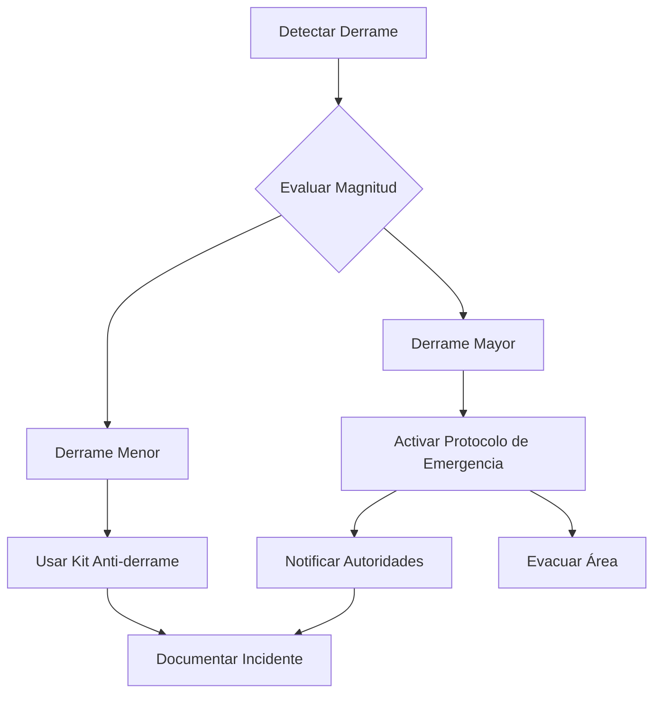

# Protocolos de Seguridad para el Traslado de Ácido Sulfúrico

## 1. Protocolos de Seguridad

### 1.1 Equipo de Protección Personal (EPP) Obligatorio

- Traje químico resistente a ácidos Tipo 1 o 2
- Máscara facial completa con filtros para gases ácidos
- Guantes de neopreno o PVC resistentes a químicos
- Botas de seguridad con resistencia química
- Equipo de respiración autónomo (disponible para emergencias)

### 1.2 Rutas Preferentes

- Uso exclusivo de carreteras federales autorizadas
- Evitar zonas urbanas densamente pobladas
- Prohibido circular en horarios de alta congestión (6:00-9:00 y 17:00-20:00)
- Paradas técnicas solo en puntos previamente autorizados
- Distancia mínima de 300 metros con otros vehículos de carga peligrosa

### 1.3 Sistema de Monitoreo

- GPS con actualización cada 5 minutos
- Sensores de presión y temperatura en tiempo real
- Cámaras de vigilancia frontal y posterior
- Sistema de comunicación redundante (radio y satelital)
- Botón de pánico con notificación inmediata

## 2. Procedimientos de Carga y Descarga

### 2.1 Protocolo de Carga

1. Inspección pre-carga del tanque y válvulas
2. Verificación de documentación y permisos
3. Colocación de EPP completo
4. Conexión a tierra del vehículo
5. Verificación de presión y temperatura
6. Apertura gradual de válvulas
7. Monitoreo constante durante la carga
8. Cierre y verificación de sellos

### 2.2 Protocolo de Descarga

1. Asegurar área de descarga (perímetro de seguridad 50m)
2. Verificación de conexiones y mangueras
3. Prueba de presión en líneas de descarga
4. Apertura secuencial de válvulas
5. Control continuo de presión
6. Procedimiento de cierre y despresurización
7. Verificación final de sellos

## 3. Plan de Contingencia

### 3.1 En Caso de Derrame

### 3.2 Procedimiento de Emergencia

1. **Evaluación Inicial**

   - Asegurar el área
   - Identificar riesgos inmediatos
   - Notificar al centro de control

2. **Acciones Inmediatas**

   - Activar señales de emergencia
   - Colocar triángulos reflectivos
   - Establecer zona de seguridad

3. **Comunicación**
   - Contactar servicios de emergencia
   - Informar a supervisores
   - Notificar a autoridades ambientales

### 3.3 Kit de Emergencia Obligatorio

- Material absorbente (vermiculita)
- Diques de contención
- Neutralizador de ácido
- Bomba de trasvase
- Herramientas antichispa
- Kit de primeros auxilios especializado

## 4. Señalización y Etiquetado

### 4.1 Identificación del Vehículo

- Carteles UN 1830
- Rombo de seguridad NFPA 704
- Números de emergencia visibles
- Placas reflectivas perimetrales
- Identificación de transportista

### 4.2 Etiquetado de Contenedor

- Nombre del producto: ÁCIDO SULFÚRICO
- Concentración: 98%
- Pictogramas GHS
- Información del fabricante
- Números de emergencia

## 5. Referencias Normativas

- NOM-002-SCT/2011: Listado de las substancias y materiales peligrosos
- NOM-004-SCT/2008: Sistemas de identificación
- NOM-005-SCT/2008: Información de emergencia
- NOM-007-SCT2/2010: Marcado de envases y embalajes
- ADR 2023: Acuerdo Europeo sobre Transporte de Mercancías Peligrosas

## 6. Contactos de Emergencia

### 6.1 Números Prioritarios

- **Centro de Control**: [Número interno]
- **Supervisor de Seguridad**: [Número 24/7]
- **Emergencias Químicas**: 800-710-4943
- **Bomberos**: 068
- **Protección Civil**: 911

### 6.2 Asistencia Técnica

- **Asesor Técnico Químico**: [Número de guardia]
- **Mantenimiento de Unidades**: [Número de servicio]
- **Aseguradora**: [Número de asistencia]
